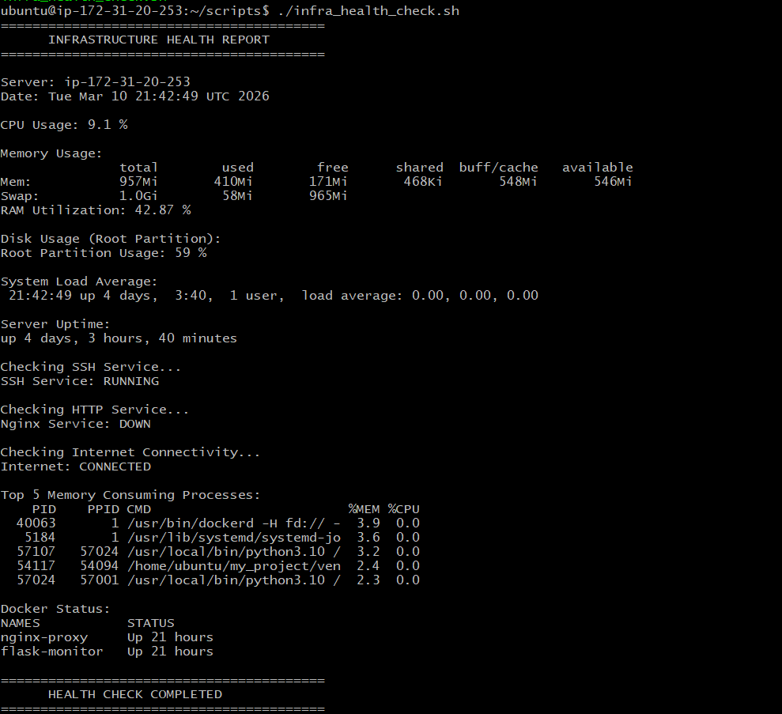

# Linux Infrastructure Health Monitor

A lightweight Bash-based monitoring system for Linux servers.

## Features

- CPU usage monitoring
- Memory usage monitoring
- Disk usage monitoring
- System uptime tracking
- Service health checks (SSH, Nginx)
- Docker container monitoring
- Automated reporting

## Architecture

Linux Server
     │
     ▼
Infrastructure Monitoring Scripts
     │
     ▼
System Metrics Collection
(CPU, Memory, Disk, Uptime)
     │
     ▼
Service Health Checks
(SSH, Nginx, Docker)
     │
     ▼
Scheduled Automation
via Cron Jobs

## Cron Automation

Run health check every 5 minutes:

*/5 * * * * /home/ubuntu/scripts/infra_health_check.sh >> /var/log/infra_health.log 2>&1

Run email report every hour:

0 * * * * /home/ubuntu/scripts/infra_email_report.sh

## Example Output

CPU Usage
Memory Usage
Disk Usage
System Uptime
Service Status
Docker Container Status

## Requirements

Linux (Ubuntu recommended)

mailutils (for email reports)

Docker (optional for container monitoring)

## Example Output

Below is a sample output of the infrastructure monitoring script running on a Linux server.

## Usage

Make script executable:

chmod +x scripts/*.sh

Run manually:

./scripts/infra_health_check.sh
